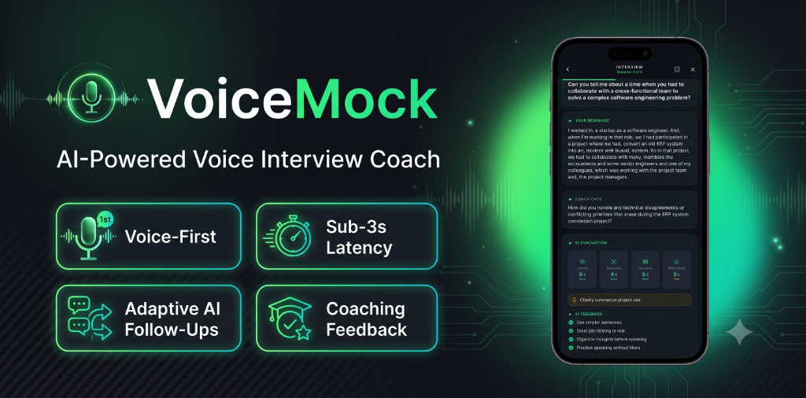
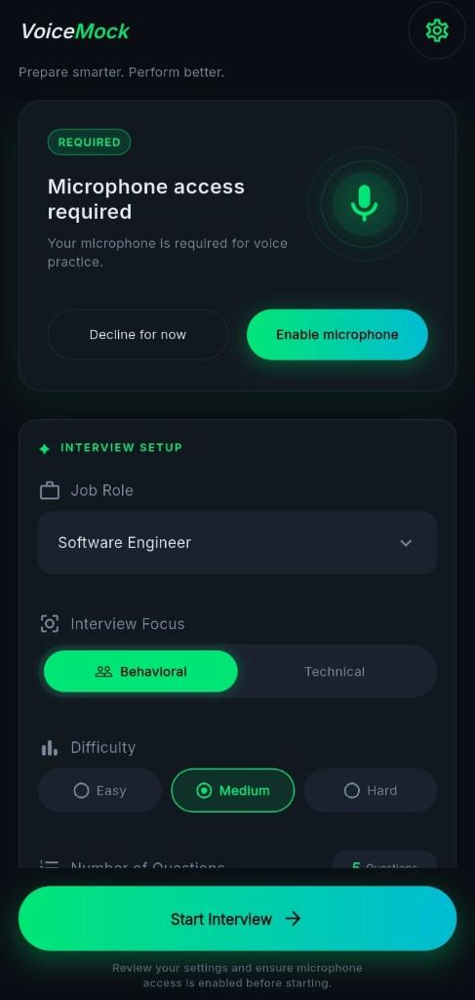
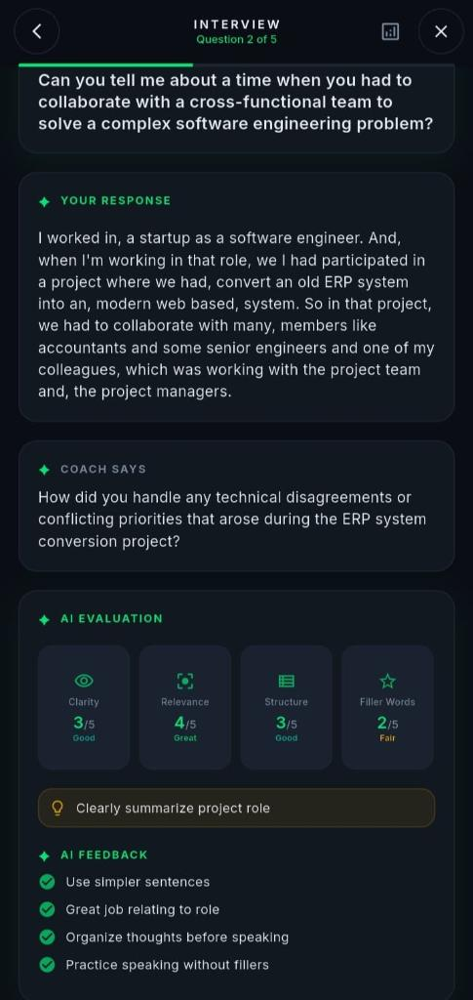
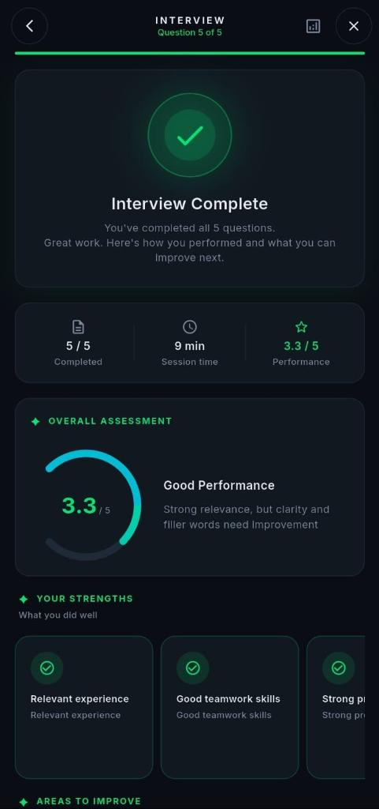
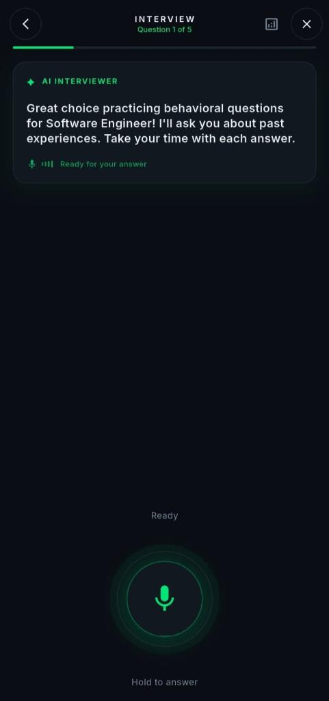
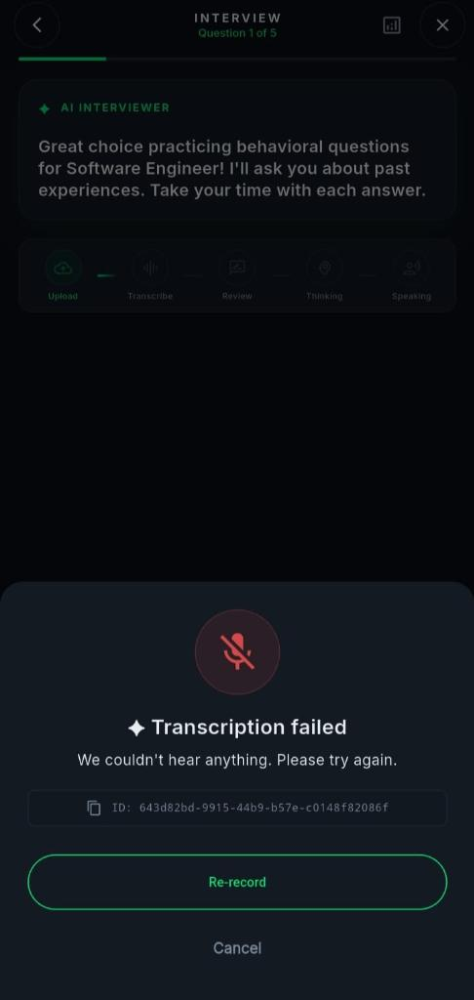
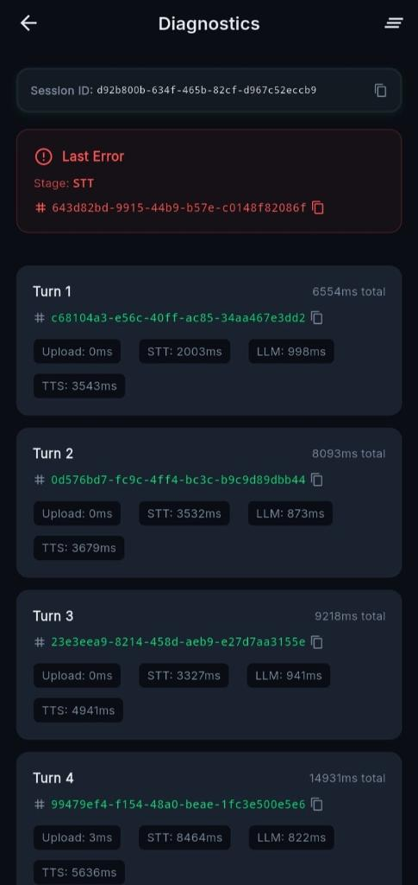
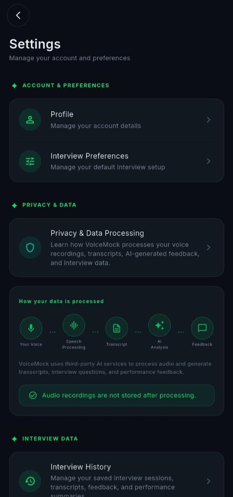

# 🎙️ VoiceMock — AI Interview Coach

> A voice-first mobile app that simulates real job interviews using AI — speak your answers, get intelligent follow-up questions, and receive actionable coaching feedback.


<!-- BANNER: replace the line below with your banner image -->


---

## 📖 Overview

VoiceMock is a **production-style voice agent** that puts you inside a realistic job interview. You hold a button to speak your answer, the system transcribes it, generates a contextual follow-up question using an LLM, converts the response to speech, and plays it back — all in under 3 seconds.

At the end of a 5-question session, you receive a detailed coaching summary covering clarity, structure, confidence, and filler-word usage.

**Why it exists:**
- Job seekers and students need a low-stakes way to practice spoken interviews
- Existing tools are either static question lists or text-only chatbots — VoiceMock is voice-native
- It demonstrates a complete, production-grade **voice agent loop**: `Audio Capture → STT → LLM → TTS → Playback`

---

## 🛠️ Tech Stack

| Layer | Technology |
|---|---|
| **Mobile App** | Flutter (Dart), `flutter_bloc 9.1.1`, `go_router 17.0.1` |
| **Audio Capture** | `record 6.1.2`, `audio_session 0.2.2` |
| **Audio Playback** | `just_audio 0.10.5` |
| **Backend API** | FastAPI `0.128.0`, Python 3.11+, Uvicorn |
| **STT** | Deepgram Nova-2 (`deepgram-sdk 5.3.1`) |
| **LLM** | Groq Llama 3 (`groq 1.0.0`) |
| **TTS** | Deepgram Aura (`deepgram-sdk 5.3.1`) |
| **Validation** | Pydantic v2 (`pydantic 2.12.5`) |
| **Rate Limiting** | `slowapi 0.1.9` |
| **Token Signing** | `itsdangerous 2.2.0` |
| **Deployment** | Docker, Render.com |
| **Mobile Testing** | Flutter test, `bloc_test` |
| **API Testing** | pytest, httpx |
| **CI/CD** | GitHub Actions |

---

## 📸 Screenshots

<!-- Replace the placeholders below with your actual screenshots -->

| Home / Setup | Interview Screen | Session Summary |
|:---:|:---:|:---:|
|  |  |  |

| Recording State | Error Recovery | Diagnostics | Settings Screen |
|:---:|:---:|:---:|:---:|
|  |  |  |  |

---

## ✨ Features

- 🎙️ **Push-to-talk recording** — hold to answer, release to send; no barge-in confusion
- 🔁 **Adaptive follow-up questions** — the LLM reacts to *your* answer, not a static script
- 📢 **Voice playback** — AI interviewer speaks back in a natural TTS voice
- 📋 **Transcript trust layer** — review your transcribed answer and re-record if needed
- 📊 **End-of-session coaching summary** — grammar/clarity, confidence, structure, filler words
- ⚡ **Latency-first design** — P50/P95 voice loop ≤ 3.0s (STT → LLM → TTS)
- 🛡️ **Stage-aware error recovery** — every failure carries a `stage`, `retryable` flag, and `request_id`
- 🔍 **Diagnostics screen** — per-stage timing metrics, last error, and request IDs for demo debugging
- 🔒 **Privacy by default** — no raw audio stored; transcripts are session-scoped and deletable
- 🚦 **Strict state machine** — `Ready → Recording → Uploading → Transcribing → Thinking → Speaking` with no-overlap audio rules
- ♿ **Accessible** — every spoken response has a visible text equivalent

---

## 🏗️ Architecture

VoiceMock follows a **clean monorepo layout** with strict module boundaries between the mobile client and backend service.

### Design Patterns

- **Mobile:** Feature-first Flutter structure with `flutter_bloc` Cubit state machine as the single source of truth for interview flow
- **Backend:** Provider Adapter pattern with a central orchestrator pipeline (`STT → LLM → TTS`) and clean separation of routes / services / providers / domain / observability
- **API:** REST + wrapped JSON envelope `{ data, error, request_id }` on every response; short-lived TTS audio served via a dedicated fetch endpoint

### Data Flow

```
User holds Talk button
    → Audio captured locally (record)
    → POST /turn (multipart upload)
        → Deepgram STT → transcript
        → Groq Llama 3 → assistant_text + tts_audio_url
        → Deepgram TTS → audio bytes cached server-side
    → Mobile fetches GET /tts/{request_id}
    → just_audio plays response
    → Returns to Ready state
```

### Folder Structure

```
voicemock-ai-interview/
├── apps/
│   └── mobile/                   # Flutter app (Very Good Flutter App)
│       ├── lib/
│       │   ├── core/
│       │   │   ├── http/          # API client, request ID interceptor
│       │   │   ├── audio/         # Recording, playback, audio session
│       │   │   └── models/        # API envelope + session/turn models
│       │   └── features/
│       │       └── interview/
│       │           ├── data/      # Repository, DTOs
│       │           ├── domain/    # InterviewStage, InterviewFailure
│       │           └── presentation/
│       │               ├── cubit/ # InterviewCubit (state machine)
│       │               ├── view/  # Pages and views
│       │               └── widgets/ # PTT button, transcript layer, player
│       └── test/
├── services/
│   └── api/                      # FastAPI backend
│       ├── src/
│       │   ├── api/routes/        # session, turn, tts, health endpoints
│       │   ├── services/          # Orchestrator, session store, TTS cache
│       │   ├── providers/         # Deepgram STT/TTS, Groq LLM adapters
│       │   ├── domain/            # SessionState, TurnState, pipeline stages
│       │   ├── observability/     # Request ID middleware, timing, logging
│       │   ├── security/          # Session tokens, rate limiting
│       │   └── settings/          # Pydantic settings / env config
│       └── tests/
│           ├── unit/
│           └── integration/
├── contracts/                    # Shared API contracts and naming rules
├── docs/                         # PRD, architecture, UX specs, API examples
└── .github/workflows/            # CI pipelines (mobile + api)
```

---

## 🚀 Getting Started

### Prerequisites

- Flutter SDK (3.x)
- Python 3.11+
- Docker (optional, for containerized backend)
- API keys: **Deepgram**, **Groq**

---

### 1. Clone the repository

```bash
git clone https://github.com/AvishkaGihan/voicemock-ai-interview.git
cd voicemock-ai-interview
```

---

### 2. Backend Setup (`services/api`)

```bash
cd services/api

# Create and activate a virtual environment
python -m venv .venv
.venv\Scripts\activate       # Windows
# source .venv/bin/activate  # macOS/Linux

# Install dependencies
pip install -r requirements.txt

# Configure environment
cp .env.example .env
# Edit .env and add your API keys (see Environment Variables section)

# Run the API server
uvicorn src.main:app --host 0.0.0.0 --port 8000 --reload
```

**Or run with Docker:**

```bash
docker build -t voicemock-api .
docker run -p 8000:8000 --env-file .env voicemock-api
```

The API will be available at `http://localhost:8000`. Swagger docs at `http://localhost:8000/docs`.

---

### 3. Mobile App Setup (`apps/mobile`)

```bash
cd apps/mobile

# Install Flutter dependencies
flutter pub get

# Run on Android emulator (development flavor)
flutter run --flavor development --target lib/main_development.dart
```

> **Android emulator note:** The default `API_BASE_URL` is `http://10.0.2.2:8000`, which routes to `localhost` from the emulator. Make sure the backend is running first.

---

### 4. Environment Variables

Create a `.env` file at the project root (copy from `.env.example`) and also at `services/api/.env`:

```env
# Backend server port
PORT=8000

# App environment: development | staging | production
APP_ENV=development

# Flutter app: backend base URL
API_BASE_URL=http://10.0.2.2:8000

# Groq — LLM
GROQ_API_KEY=your-groq-key-here
LLM_MODEL=llama-3.3-70b-versatile

# Deepgram — STT + TTS
DEEPGRAM_API_KEY=your-deepgram-key-here
```

See [`.env.example`](./.env.example) and [`services/api/.env.example`](./services/api/.env.example) for the full list of available variables.

---

## 🧪 Testing

### Backend (pytest)

```bash
cd services/api

# Run all tests
pytest

# Run with coverage
pytest --cov=src --cov-report=term-missing

# Run only unit tests
pytest tests/unit/

# Run only integration tests
pytest tests/integration/
```

**What's tested:**
- Turn orchestration pipeline (STT → LLM → TTS sequencing and error handling)
- Session store TTL and token verification
- Safety filter and refusal behavior
- Stage-aware error taxonomy and response envelope format
- Rate limiting and payload size guards
- Diagnostic timing data correctness

---

### Mobile (Flutter test)

```bash
cd apps/mobile

# Run all tests
flutter test

# Run with coverage
flutter test --coverage

# Run a specific test file
flutter test test/features/interview/presentation/cubit/interview_cubit_test.dart
```

**What's tested:**
- `InterviewCubit` state machine transitions and guards (no-overlap rules)
- Repository and DTO parsing
- Audio service mocks
- Widget smoke tests

---

## 📡 API Reference

Base URL: `http://localhost:8000`

All JSON responses use the envelope format:
```json
{ "data": <payload>, "error": null, "request_id": "<uuid>" }
```

| Method | Endpoint | Auth | Description |
|--------|----------|------|-------------|
| `POST` | `/session/start` | None | Start a new interview session; returns `session_id` + `session_token` |
| `POST` | `/turn` | `Bearer <session_token>` | Upload answer audio (multipart); returns transcript, assistant text, TTS URL |
| `GET` | `/tts/{request_id}` | `Bearer <session_token>` | Fetch TTS audio bytes (short-lived cache) |
| `GET` | `/healthz` | None | Health check + diagnostic metadata |

### Error Object Format

```json
{
  "data": null,
  "error": {
    "stage": "stt",
    "code": "stt_timeout",
    "message_safe": "Transcription timed out. Please try again.",
    "retryable": true,
    "request_id": "uuid"
  },
  "request_id": "uuid"
}
```

Error `stage` values: `upload | stt | llm | tts | unknown`

Full API examples live in [`docs/api/`](./docs/api/).

---

## 🤔 Technical Decisions

### Why Flutter?
Cross-platform (Android + iOS) from one codebase with excellent audio plugin support (`record`, `just_audio`, `audio_session`). The Very Good Flutter App template gave us testing infrastructure and linting conventions out of the box.

### Why FastAPI + Python?
Deepgram and Groq both have first-class Python SDKs. FastAPI's async support keeps the pipeline non-blocking and its OpenAPI generation is automatic. Pydantic v2 enforces strict request/response validation at zero runtime cost.

### Why Groq for LLM?
Groq's inference hardware achieves sub-second token generation, which is critical for hitting the ≤ 3.0s P50 voice loop target. Swapping to another provider (e.g., OpenAI) is a one-file change via the provider adapter pattern.

### Why Deepgram for STT + TTS?
Nova-2 delivers high transcription accuracy at low latency. Aura TTS produces natural-sounding speech quickly. Using one vendor for both audio services simplifies key management and reduces API round-trip variance.

### Why in-memory sessions (no database)?
MVP guest-only sessions need no persistence. Server-authoritative in-memory sessions with TTL expiry keep the stack minimal, latency low, and operating costs near-zero. A Redis swap is a single-layer change when scaling.

### Why a two-step TTS fetch?
Separating `POST /turn` (JSON response) from `GET /tts/{request_id}` (audio bytes) lets the mobile client show the transcript and assistant text immediately, then stream audio — improving perceived responsiveness and enabling future streaming upgrades.

---

## 💡 Challenges & Solutions

**Challenge: Sub-3-second voice loop latency**
Achieving P50 ≤ 3.0s across STT → LLM → TTS required provider selection for raw speed (Groq inference + Deepgram), fine-tuned timeout budgets per stage, and a two-step response so the client isn't blocked waiting for audio bytes before showing text.

**Challenge: Audio state machine correctness**
"Double speak" (overlapping TTS) and UI freezes during state transitions were prevented by making `InterviewCubit` the single source of truth with hard guards — no concurrent recording + playback possible, and no UI boolean flags outside the state machine.

**Challenge: Stage-aware error recovery**
Generic "something went wrong" errors make voice apps feel broken. Each pipeline stage (`upload / stt / llm / tts`) produces a typed error with a `retryable` flag and `request_id`, so the UI can offer the right recovery action (retry, re-record, or cancel) and the user never sees a dead-end.

**Challenge: Privacy with audio data**
Raw audio is never persisted. Transcripts are scoped to the session and deletable. API logs redact PII. This design satisfies GDPR-aligned data minimisation without requiring a full consent management platform in the MVP.

---

## 🔮 Future Improvements

- **Voice Activity Detection (VAD)** — remove push-to-talk friction; detect end-of-speech automatically
- **Streaming responses** — progressive STT + partial TTS to reduce perceived latency further
- **Role packs** — curated question banks for specific roles (React, Flutter, Product Manager, etc.)
- **Resume upload** — tailor questions to the candidate's actual experience
- **Session history & trends** — track improvement across sessions with charts
- **Redis session store** — replace in-memory store for horizontal scaling
- **Dockerize full stack** — `docker compose` for one-command local dev
- **Real-time barge-in** — allow user to interrupt TTS playback mid-sentence
- **Multi-language support** — accent coaching and pronunciation feedback beyond English

---

## 🔐 Security & Privacy

- All client ↔ backend and backend ↔ provider traffic uses **HTTPS (TLS 1.2+)**
- Session tokens are signed with `itsdangerous` (signed opaque token with `iat`/`exp`)
- **Raw audio is never stored** — only transient upload handling during the pipeline
- Transcript logging is **disabled by default**; opt-in via debug flag
- Logs never contain raw audio and are scanned against a field allowlist for PII
- Basic **safety filter** rejects disallowed content with a stage-aware refusal response
- Rate limiting on high-cost endpoints (`/turn`, `/tts`) via `slowapi`

---

## 🧩 CI/CD

GitHub Actions runs two independent pipelines on every push to `main` and on all pull requests:

| Workflow | Trigger | Steps |
|---|---|---|
| `mobile_ci.yml` | Push / PR | Flutter analyze, `flutter test` |
| `api_ci.yml` | Push / PR | `pip install`, `pytest` |

See [`.github/workflows/`](./.github/workflows/) for full configuration.

---

## 📄 License

This project is licensed under the **MIT License** — see the [LICENSE](./LICENSE) file for details.

---

## 🤝 Contributing

Pull requests are welcome. For major changes, please open an issue first to discuss what you'd like to change.

Please make sure to update or add tests as appropriate and follow the existing code style (see [`.editorconfig`](./.editorconfig) and [`CONTRIBUTING.md`](./CONTRIBUTING.md)).

---

## 📬 Contact

**Avishka Gihan** — [@AvishkaGihan](https://github.com/AvishkaGihan)

> *Built as a portfolio-quality voice agent demonstration — showing production-grade architecture, latency engineering, and audio UX in a real mobile product.*
