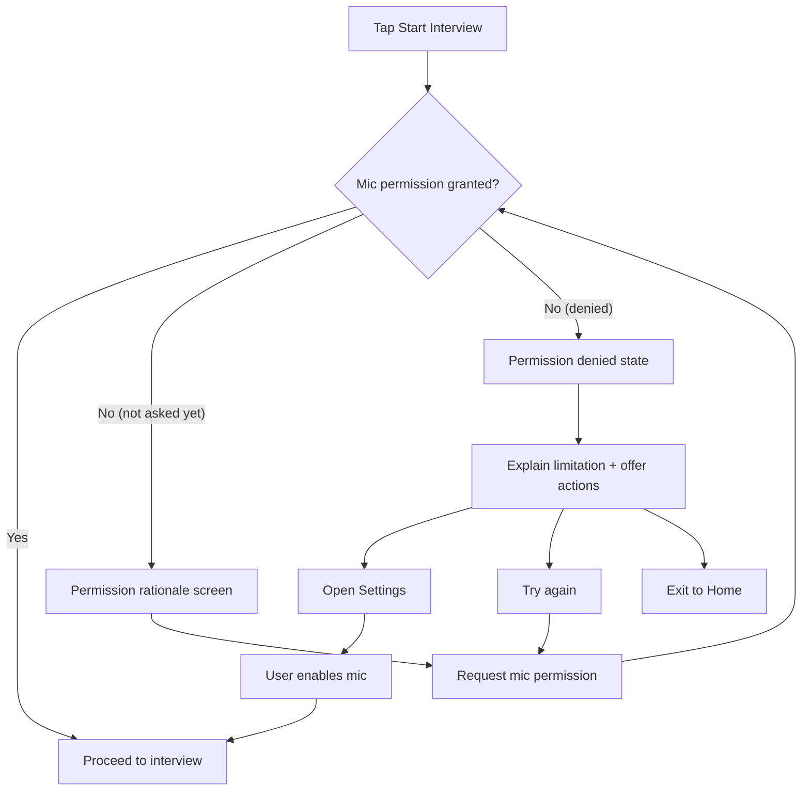

---
stepsCompleted:
  - step-01-init
  - step-02-discovery
  - step-03-core-experience
  - step-04-emotional-response
  - step-05-inspiration
  - step-06-design-system
  - step-07-defining-experience
  - step-08-visual-foundation
  - step-09-design-directions
  - step-10-user-journeys
  - step-11-component-strategy
  - step-12-ux-patterns
  - step-13-responsive-accessibility
  - step-14-complete
inputDocuments:
  - _bmad-output/planning-artifacts/prd.md
  - _bmad-output/planning-artifacts/prd.validation-report.md
  - docs/voicemock-prd-brief.md
project:
  name: voicemock-ai-interview
meta:
  author: AvishkaGihan
  date: 2026-01-27
  communicationLanguage: English
  documentOutputLanguage: English
  userSkillLevel: intermediate
lastStep: 14
---

# UX Design Specification voicemock-ai-interview

**Author:** AvishkaGihan
**Date:** 2026-01-27

---

<!-- UX design content will be appended sequentially through collaborative workflow steps -->

## Executive Summary

### Project Vision

VoiceMock is a **voice-first mobile interview coach** that simulates a realistic interview conversation. The experience is built around a tight, repeatable loop: the user speaks an answer, the system transcribes it, generates a relevant follow-up, and speaks back—ending with clear coaching feedback that helps the user feel more confident over time.

For MVP, the product wins when it feels **conversational, trustworthy, and resilient**: no awkward “dead air” without explanation, no overlapping audio, and no confusion about what the system is doing.

### Target Users

- **Primary users:** job seekers, students, and non-native English speakers who want to practice spoken interview answers privately and build confidence.
- **High-context usage:** often on mobile in real-world conditions (quiet rooms and imperfect environments like buses/dorms), so the UX must tolerate noise and flaky networks.
- **Secondary user (portfolio operator/admin):** the builder/demo presenter who needs a lightweight diagnostics surface (request ID, stage timings, provider info, last error) to troubleshoot and explain performance.

### Key Design Challenges

- **Turn-taking clarity:** users must always know whether they should be speaking or listening; the UI must prevent recording during playback and prevent overlapping TTS.
- **Perceived latency management:** even when real latency is unavoidable, the experience must feel responsive via clear state transitions (Uploading → Transcribing → Thinking → Speaking) and time-bound feedback.
- **Trust & transparency:** users need to see “what the app heard” (transcript preview) and understand that audio is processed by third-party services; provide deletion controls and safe defaults around retention.
- **Error recovery without anxiety:** network/provider failures should never look like a hang; show what failed (stage), what to do next (Retry/Cancel), and a short request ID.

### Design Opportunities

- **Make silence feel safe:** use microcopy + progressive status indicators so waiting feels intentional, not broken—especially for anxious users.
- **Coach like a human:** provide feedback that is short, actionable, and supportive; avoid overwhelming users mid-session, and keep the end-of-session summary skimmable.
- **Voice-first, not voice-only:** pair every spoken system turn with readable text (question + transcript + key coaching points) for accessibility, comprehension, and noisy environments.
- **Portfolio-grade “debug mode” UX:** a tasteful, optional diagnostics panel can become a differentiator in demos while staying hidden from typical users.

## Core User Experience

### Defining Experience

VoiceMock’s core experience is a **tight, calming voice turn-taking loop** that feels like a real interview but stays safe for anxious users:

1) User configures role/type/difficulty and starts an interview (default: 5 questions)
2) The AI asks a question (voice + readable text)
3) The user answers via **push-to-talk** (hold to record, release to send)
4) The app visibly moves through **Uploading → Transcribing → Thinking → Speaking**
5) The AI replies with a natural follow-up (voice + text), and the loop repeats
6) End-of-session: the user receives a **short, actionable coaching summary**

The experience should feel **conversational**, but never ambiguous: the user always knows “it’s my turn” vs “it’s listening/thinking” vs “it’s speaking”.

### Platform Strategy

- **Primary platform:** mobile app (touch-first), optimized for one-handed use.
- **MVP interaction model:** push-to-talk (deterministic turn-taking and simpler mental model than hands-free voice).
- **Accessibility baseline:** voice-first but not voice-only—every spoken output also appears as readable text; transcripts are visible for user comprehension and noisy environments.
- **Offline stance (MVP):** no offline interview generation; clear “requires internet” gating and messaging.

### Effortless Interactions

The following must feel effortless (minimal cognitive load, minimal taps, no uncertainty):

- **Start session quickly:** role/type/difficulty selection is fast, with sensible defaults and “last used” memory.
- **Speak with confidence:** clear mic affordance (hold-to-talk), clear “Recording…” state, and a clean end-of-recording handoff.
- **Understand what happened:** show the transcript of the last answer (“what the app heard”) as soon as available.
- **Recover from failure:** if any stage fails, provide a single clear next action (Retry / Re-record / Cancel), never silent waiting.
- **Consume feedback:** feedback is short, specific, and skimmable; deeper detail can be optional.

### Critical Success Moments

- **First 30 seconds:** user grants mic permission, speaks once, and gets a response without confusion—this is make-or-break.
- **First follow-up question:** the AI asks something that clearly relates to what the user said; this creates the “real interview” feeling.
- **First recovery:** when something goes wrong (network/noise/provider), the app explains the failure and offers an immediate next step—trust is earned here.
- **End-of-session summary:** user finishes with a feeling of progress (“I know what to improve next”) rather than a vague score dump.

### Experience Principles

1) **Always show whose turn it is** (speak vs listen)
2) **Silence must be explained** (explicit states + time-bounded feedback; no “stuck thinking”)
3) **Voice-first, not voice-only** (text pairing + transcripts for clarity and accessibility)
4) **Trust by design** (transparency about processing, deletion controls, clear errors)
5) **Coach with kindness and precision** (actionable feedback, not judgment)

## Desired Emotional Response

### Primary Emotional Goals

1) **Calm confidence:** reduce the anxiety of speaking out loud by making the experience predictable and supportive.
2) **In control:** the user always feels they can act next (talk, retry, re-record, cancel) and understands what the system is doing.
3) **Motivated improvement:** feedback feels actionable and encouraging—users leave with a clear “next time I’ll do X” plan.

### Emotional Journey Mapping

- **First-time open / onboarding:** Curious + safe (“This won’t judge me.”) with clear privacy/permission rationale.
- **First question:** Slight nerves → quickly stabilized by a clear “your turn” moment and friendly pacing.
- **While answering (recording):** Focused + supported (simple mic interaction, visible recording state).
- **While waiting (processing):** Trust maintained (explicit stage progression; silence is explained).
- **While listening (AI speaking):** Engaged + respected (clear audio, readable text backup).
- **After feedback / end-of-session summary:** Accomplished + energized (wins highlighted, improvements prioritized, next steps clear).
- **When something goes wrong:** Calm recovery (no blame, no panic language, clear actions).

### Micro-Emotions

- **Confidence over confusion:** always show “whose turn” it is.
- **Trust over skepticism:** transparency (transcript preview + request ID on failures).
- **Safety over shame:** coaching tone is supportive; critique is framed as growth.
- **Satisfaction over frustration:** fast retries, clear error boundaries, no dead ends.
- **Progress over perfection:** users feel better each session, not graded as “good/bad”.

### Design Implications

- **Calm confidence** → warm microcopy, stable UI states, “you’re doing great” reinforcement at the right moments.
- **In control** → deterministic push-to-talk, explicit stage labels, cancel/stop always available, no overlapping audio.
- **Motivated improvement** → feedback is short + prioritized, with 1–3 concrete tips and optional detail.
- **Trust** → show “what we heard” transcript quickly; disclose third-party processing; provide delete controls.
- **Resilience** → errors describe: what failed (stage), what to do (Retry/Re-record/Cancel), and a short request ID.

### Emotional Design Principles

1) **Stability beats cleverness** (predictable loop reduces anxiety)
2) **Explain silence** (waiting is always intentional and visible)
3) **Never shame the user** (coach with kindness + clarity)
4) **Give agency at every step** (retry/re-record/cancel are always reachable)
5) **Make progress feel real** (highlight wins + next actions, not only scores)

## UX Pattern Analysis & Inspiration

### Inspiring Products Analysis

**1) ChatGPT Voice (and modern voice chat experiences)**

- Strength: conversational pacing + clear “listening/thinking/speaking” mental model.
- Lesson: users tolerate latency when the system narrates progress and never feels stuck.
- Adaptation for VoiceMock: explicit stage UI + optional subtle “sound cues” (start/stop recording; response ready).

**2) Duolingo (coaching + motivation loops)**

- Strength: positive reinforcement + bite-sized feedback that encourages repetition.
- Lesson: improvement feels achievable when feedback is prioritized (1–3 focus items) and framed as progress.
- Adaptation for VoiceMock: “wins + next time try…” coaching, small streak/return hooks (post-MVP).

**3) Headspace/Calm (anxiety-aware UX)**

- Strength: calm visual rhythm, soft tone, minimal choices at the moment of stress.
- Lesson: reduce cognitive load during vulnerable moments; keep UI stable and predictable.
- Adaptation for VoiceMock: calm color palette, simple layouts, and non-alarming error language.

**4) WhatsApp voice notes / audio players (recording + playback ergonomics)**

- Strength: obvious recording affordance + reliable playback controls.
- Lesson: audio UX succeeds when controls are consistent and forgiving.
- Adaptation for VoiceMock: clear mic affordance, playback queue rules, replay last prompt, and “stop speaking” action.

### Transferable UX Patterns

**Navigation Patterns**

- **Tab-based shell (simple IA):** Home (Start) / History (post-MVP) / Profile/Settings / Debug (hidden).
- **Single primary CTA:** “Start interview” or “Hold to Talk” dominates the screen.

**Interaction Patterns**

- **Deterministic turn-taking:** push-to-talk enforces one active state at a time (record OR play OR process).
- **Progressive disclosure:** keep the “core loop” screen clean; advanced controls (debug, provider selection) tucked away.
- **Transcript as trust layer:** show “what we heard” after each turn; allow quick “re-record” if wrong.
- **Feedback layering:** immediate micro-feedback (1 key tip) + deeper summary at end.

**Visual Patterns**

- **Calm state machine UI:** stable layout + clear stage labels (Uploading/Transcribing/Thinking/Speaking).
- **Large typography + high contrast:** supports quick scanning during anxiety and noisy contexts.

### Anti-Patterns to Avoid

- **Silent waiting:** “Thinking…” without progress or time expectation erodes trust fast.
- **Over-chatty coaching:** long paragraphs mid-session increase cognitive load and shame risk.
- **Ambiguous mic states:** unclear whether the app is recording, uploading, or idle.
- **Overuse of red/error styling:** makes anxious users feel they “failed”; reserve red for true blockers.
- **Hidden recovery:** failures that auto-retry forever without giving the user agency.

### Design Inspiration Strategy

**What to Adopt**

- Clear voice conversation state model (ChatGPT Voice-style clarity).
- Encouraging, structured coaching tone (Duolingo-style progress framing).
- Calm, low-friction layouts (Headspace/Calm-style stability).

**What to Adapt**

- Voice UI patterns to a strict interview turn-taking loop (more structured than open-ended chat).
- Coaching feedback into “1–3 prioritized improvements” to avoid overwhelm.
- Audio playback controls into a single-response queue to prevent overlapping speech.

**What to Avoid**

- Any UX that makes users wonder “is it listening?” or “did it break?”
- Any feedback framing that feels judgmental or score-first without actionable next steps.

## Design System Foundation

### 1.1 Design System Choice

Use a **themeable, established design system foundation**: Material Design 3 as the baseline, customized via design tokens (color, type, spacing, radius) to support a calm, confidence-building voice-first experience.

### Rationale for Selection

- **Speed + consistency:** proven components reduce design/development time for MVP.
- **Accessibility defaults:** better baseline contrast, touch targets, and semantics.
- **Predictable interaction patterns:** supports the “stability beats cleverness” emotional goal.
- **Low maintenance:** fewer bespoke components to maintain while iterating.
- **Still brandable:** token-based theming prevents the UI from feeling “stock Material.”

### Implementation Approach

- Start with a small component set needed for the core loop:
  - Buttons (primary/secondary/destructive), cards/panels, bottom sheets/modals
  - Progress/step indicators (for Uploading/Transcribing/Thinking/Speaking)
  - Audio controls (play/pause/stop/replay), toasts/snackbars, empty/error states
- Define state styling rules early (idle/recording/processing/speaking/error) to avoid visual drift.

### Customization Strategy

- Define a minimal token set:
  - Calm primary color + neutral background scale
  - Status colors with restrained usage (especially error)
  - Typography scale optimized for mobile readability
  - Shape/radius system for a softer feel
- Apply tokens consistently across:
  - Core loop screen, errors/recovery, and session summary
- Keep “debug mode” visually separated but still on-system.

## 2. Core User Experience

### 2.1 Defining Experience

The defining experience of VoiceMock is **a structured, voice-first interview turn** that feels real, calm, and controllable:

**“Hold to talk → speak → release → see what the app heard → watch clear progress → hear a relevant follow-up.”**

If this single interaction feels effortless (even under bad network/noise), the rest of the product feels inevitable.

### 2.2 User Mental Model

Users arrive with a mental model shaped by:

- **Real interviews:** turn-taking, pressure, and fear of “saying the wrong thing”.
- **Voice notes:** press/hold to record, release to send.
- **Voice assistants:** speaking prompts, but often frustration with “did it hear me?” ambiguity.

Likely confusion points:

- Not knowing if the app is actively recording vs idle.
- Not trusting transcription accuracy (“that’s not what I said”).
- Not understanding latency (“is it broken?”).
- Feeling judged by feedback if tone is harsh or score-first.

### 2.3 Success Criteria

Users experience the core turn as successful when:

- **Turn-taking is unambiguous:** it’s always clear whose turn it is (user vs AI).
- **Response feels fast enough:** waiting is explained and time-bounded with visible progress states.
- **Transcript builds trust:** the user can see “what was heard” and quickly re-record if wrong.
- **Audio never overlaps:** no talking over itself; playback is single-queued and cancellable.
- **Recovery is effortless:** if anything fails, the user gets a clear next action (Retry / Re-record / Cancel) plus a request ID.

### 2.4 Novel UX Patterns

This experience is **mostly established patterns combined in a focused way**:

- Established: push-to-talk, status/progress states, audio playback controls, transcript preview.
- Novel twist: applying these patterns to a **high-stakes, anxiety-aware coaching loop** where tone, clarity, and trust matter as much as speed.

User education can be light because the core mechanic is familiar:

- “Hold to talk. Release to send.”
- “We’ll show you the transcript before we respond.”

### 2.5 Experience Mechanics

**1. Initiation**

- Entry point: “Start interview” / “Continue interview”.
- Question presented in voice + readable text.
- Primary CTA is always visible (Hold to Talk).

**2. Interaction**

- User presses and holds mic to record.
- UI shows recording state immediately (timer + waveform/level + “Recording…”).
- On release: recording ends and submission begins automatically.

**3. Feedback**

- The app moves through stages: Uploading → Transcribing → Thinking → Speaking.
- Transcript appears as soon as available with a fast correction path:
  - Re-record (preferred MVP)
  - Retry send (if transient error)
- During AI speaking: show text + playback controls (stop/replay).

**4. Completion**

- When AI finishes speaking, the interface returns to “your turn” affordance.
- After N questions: show a calm completion moment + summary.
- User can start another session or review summary (history post-MVP).

## Visual Design Foundation

### Color System

**Theme Choice:** Calm Ocean (calm, confident, professional coach)

**Core Tokens**

- Primary: `#2F6FED`
- Secondary (accent): `#27B39B`
- Background: `#F7F9FC`
- Surface: `#FFFFFF`
- Text (primary): `#0F172A`
- Text (muted): `#5B6475`

**Semantic Colors**

- Success: `#1E9E6A`
- Warning: `#D99A00`
- Error: `#D64545` (use sparingly; avoid “you failed” vibes)

**State Styling (Voice Loop)**

- Idle/Ready: neutral surfaces + primary CTA
- Recording: primary highlight at 20–30% opacity + clear “Recording…” label
- Uploading/Transcribing/Thinking: neutral progress UI (avoid warning/error colors)
- Speaking: subtle secondary accent to indicate “AI turn”

**Usage Rules**

- Default UI should feel neutral and calm; reserve saturated colors for key actions and small accents.
- Prefer neutral containers for errors with a clear action; avoid large red screens.

### Typography System

**Typeface:** Inter (or platform default equivalent if Inter isn’t available)

**Mobile-first Type Scale**

- H1: 28/34, semibold (screen titles)
- H2: 22/28, semibold (section headers)
- H3: 18/24, semibold (card titles)
- Body: 16/24, regular (primary text)
- Small: 14/20, regular (helper text)
- Micro: 12/16, medium (labels/status chips)

**Hierarchy Rules**

- Keep the core loop screen text short and scannable.
- Prefer one “primary” message per state (e.g., “Transcribing…”) with optional secondary detail.

### Spacing & Layout Foundation

**Base Unit:** 8dp

**Spacing Scale (recommended)**

- 8dp: tight grouping
- 16dp: default spacing
- 24dp: section spacing
- 32dp: major separation

**Layout Principles**

- **Stability first:** avoid layout jumps when moving through states (Recording → Processing → Speaking).
- **Single dominant action:** the “Hold to Talk” affordance remains visually anchored.
- **Airy but not sparse:** provide breathing room to reduce anxiety without wasting vertical space.

### Accessibility Considerations

- Aim for WCAG AA contrast for all primary text (especially state labels and buttons).
- Minimum tap targets: 44dp.
- Voice-first, not voice-only: every spoken output has readable text; transcripts are available.
- Error UX: neutral containers + clear actions; use red only as a small semantic cue.

## Design Direction Decision

### Design Directions Explored

Mockups were generated as an interactive HTML showcase:

- `_bmad-output/planning-artifacts/ux-design-directions.html`

Directions explored (D1–D8):

- D1: Calm Interview (stable / coach-like)
- D2: Timeline Clarity (state-first UI)
- D3: Conversation + Panels (chat-adjacent, still structured)
- D4: Single Action Focus (largest mic affordance)
- D5: Coach Dashboard (feedback-forward)
- D6: Bottom Sheet Controls (advanced actions tucked away)
- D7: Midnight Focus (dark mode direction)
- D8: Compact Professional (slightly denser, still calm)

### Chosen Direction

**Chosen Direction:** D2 — Timeline Clarity

### Design Rationale

- VoiceMock’s UX succeeds when the user never doubts what’s happening; a **state-first hierarchy** best supports the “silence must be explained” principle.
- The stepper-style stages reinforce the deterministic pipeline (Uploading → Transcribing → Thinking → Speaking) and reduce anxiety during latency.
- Keeps the screen stable while still allowing transcript + quick recovery actions.

### Implementation Approach

- Base the core loop screen on a split layout:
  - Top: Question + session context
  - Middle: Stage stepper + transcript preview
  - Bottom (anchored): Hold-to-talk affordance + minimal actions
- Borrow selectively from D5 (coach card) as an optional panel shown after each turn or at session end.

## User Journey Flows

### Journey 1 — Happy Path: Guest Interview Session → Summary

Goal: A first-time user completes a 5-question voice interview with minimal friction and leaves with clear next steps.

```mermaid
flowchart TD
  A[Open app] --> B{First launch?}
  B -- Yes --> C[Light onboarding: what VoiceMock does + privacy note]
  B -- No --> D[Home: Start Interview]

  C --> E[Home: Start Interview]
  D --> E

  E --> F[Configure: Role / Type / Difficulty / #Questions (default 5)]
  F --> G[Start Session]

  G --> H[Question presented (voice + text)]
  H --> I[User holds to talk (Recording state)]
  I --> J[Release to send]
  J --> K[Uploading → Transcribing → Thinking]
  K --> L[Transcript shown ("what we heard")]
  L --> M[AI speaks follow-up (voice + text)]
  M --> N{Questions remaining?}
  N -- Yes --> H
  N -- No --> O[Session complete moment]
  O --> P[Session Summary: wins + top 1–3 improvements + next steps]
  P --> Q[CTA: Start another / Review summary / (Post-MVP) History]
```

### Journey 2 — Recovery Path: Bad Network or Bad Transcript → Retry / Re-record → Continue

Goal: When something fails, the user stays calm and in control; the app never appears “stuck”.

```mermaid
flowchart TD
  A[User releases to send] --> B[Uploading / Transcribing / Thinking]
  B --> C{Stage fails?}

  C -- No --> D[Transcript shown]
  D --> E[AI speaks next question]
  E --> Z[Continue session]

  C -- Yes --> F[Error panel (neutral styling)]
  F --> G[Explain what failed + next action + Request ID]

  G --> H{User choice}
  H -- Retry --> I[Retry same stage]
  I --> B

  H -- Re-record --> J[Return to "Hold to talk" ready state]
  J --> K[User records again]
  K --> A

  H -- Cancel --> L[Exit to Home or End Session]
  L --> M[Optional: show partial progress + reassurance]
```

### Journey 3 — Permissions & First-Time Trust: Mic Permission → First Voice Turn

Goal: Get permission without anxiety; if denied, provide a clear path forward.



### Journey Patterns

- **Deterministic state machine:** Ready → Recording → Uploading → Transcribing → Thinking → Speaking → Ready
- **Always-visible control:** user can always Stop/Cancel (and never be trapped in a silent wait)
- **Transcript trust layer:** show “what we heard” quickly; allow Re-record as the primary correction
- **Errors are actionable:** error message includes stage, next action, and request ID
- **Voice-first, not voice-only:** every spoken element has readable text

### Flow Optimization Principles

- **Time-to-first-value:** first spoken turn within ~30–60 seconds of opening (guest mode helps)
- **Low cognitive load during stress:** one primary action per state; avoid excessive options mid-session
- **Silence is explained:** stage labels + subtle progress affordances; no ambiguous “thinking”
- **Recovery without blame:** calm language, neutral styling, and clear choices (Retry / Re-record / Cancel)

## Component Strategy

This component strategy keeps us **strongly on Material 3 foundations**, while introducing a small set of custom components to support the unique **voice turn-taking loop**.

**Hold-to-talk decision (confirmed):** a large, bottom-anchored **press-and-hold button** (not a slider/gesture), with immediate visual + haptic confirmation.

### Design System Components

Foundation components to adopt directly from Material 3 (Flutter Material):

- **Scaffolding:** App bars, safe-area layout patterns, surfaces, cards, dividers
- **Buttons & actions:** Filled/FilledTonal/Outlined/Text buttons, IconButton, button loading/disabled states
- **Inputs:** text fields (settings/config), switches/toggles, segmented controls (where helpful)
- **Feedback:** SnackBar (transient), Dialog/BottomSheet (blocking or decision), progress indicators
- **Lists & containers:** ListTile, cards, chips/badges (optional), expandable panels
- **Typography & theming:** token-driven color/typography/shape (Calm Ocean)

### Custom Components

Below are the **custom components** required to make the core loop feel unambiguous (“always show whose turn it is”) and resilient (“silence is explained”).

### Hold-to-Talk Button

**Purpose:** Primary “your turn” control: press and hold to record; release to send.

**Usage:** Core loop screen (always bottom-anchored, stable position across states).

**Anatomy:**

- Circular (or rounded-rect) button surface
- Mic icon + short label (“Hold to talk”)
- Recording ring / glow + elapsed timer (optional)
- Subtext area for microcopy (“Release to send”)

**States:**

- Ready: enabled, primary emphasis
- Pressed/Recording: strong recording affordance (ring animation), show “Recording…”
- Sending/Processing: disabled (prevent double-send), show “Processing…” state elsewhere
- Speaking (AI turn): disabled, optionally swap label to “Listening…”
- Permission needed: enabled, first tap/press triggers permission rationale flow
- Error: returns to Ready with an error banner/sheet available

**Variants:**

- Standard (default)
- Compact (smaller screens)
- One-handed alignment (centered default; optional thumb-zone shift post-MVP)

**Accessibility:**

- Semantics label changes by state (e.g., “Hold to record answer”, “Recording, release to send”, “Disabled while AI is speaking”)
- Minimum 44dp target; high-contrast icon + label
- Haptics: light on press-start, medium on release-send, subtle error buzz (optional)

**Content Guidelines:** Keep labels short: “Hold to talk”, “Recording…”, “Release to send”.

**Interaction Behavior:**

- Press and hold begins recording immediately (no extra confirmation)
- Releasing ends recording and starts Uploading automatically
- Long-hold safety: if user holds too long, show a soft hint (“You can release anytime”)

### Voice Pipeline Stepper (Stage Timeline)

**Purpose:** Make system work visible and time-bounded: Uploading → Transcribing → Thinking → Speaking.

**Usage:** Prominent mid-screen element during processing; minimized or idle when Ready.

**Anatomy:**

- 4 labeled steps (with icons)
- Current step highlight + subtle motion (no frantic spinners)
- Optional “time hint” line (“Usually ~5–15s”)

**States:**

- Idle: hidden or compact
- In progress: current step highlighted
- Completed: all steps completed; returns to Ready
- Failed: mark failing stage, reveal recovery actions (Retry/Re-record/Cancel)

**Accessibility:**

- Announce stage transitions via screen reader (polite)
- Ensure step labels remain readable at large text sizes

### Turn Card (Question / Transcript / Response)

**Purpose:** Provide the “voice-first, not voice-only” trust layer: what was asked, what the user said, what the AI responded.

**Usage:** Main conversation area on the core loop screen; one card per turn (or a single latest-turn card in MVP).

**Anatomy:**

- Question header (“Question 2 of 5” + text)
- Transcript preview block (“You said…”) + confidence hint
- AI response text block (“Coach says…”) shown during/after Speaking
- Small utility actions (Replay question, Re-record)

**States:**

- Question ready (AI just asked)
- Transcript pending (after send, before STT done)
- Transcript available
- Speaking (highlight AI response block)
- Error (show what’s known + recovery actions)

**Accessibility:**

- Ensure reading order matches the conversation order
- Provide “Replay question” as a clearly labeled button

### Transcript Confidence Hint

**Purpose:** Help users calibrate trust and choose Re-record quickly when STT is unreliable.

**Usage:** Inline element under transcript.

**States/Variants:**

- Normal (no warning)
- Low-confidence (neutral warning styling + suggestion: “If this isn’t right, re-record.”)

**Accessibility:** Do not use color alone; include text.

### Error Recovery Sheet (Stage Failure)

**Purpose:** Make failure actionable without anxiety.

**Usage:** Bottom sheet or panel when Uploading/Transcribing/Thinking/Speaking fails.

**Content:**

- What failed (stage)
- What to do next (primary action)
- Request ID (copyable)

**Actions:** Retry (primary), Re-record, Cancel/Exit.

**Accessibility:** Focus management on open; clear button labels.

### Diagnostics Panel (Hidden / Optional)

**Purpose:** Portfolio/demo troubleshooting without polluting the core experience.

**Usage:** Hidden behind a settings toggle or multi-tap gesture; appears as a collapsible panel.

**Content:** Request ID, stage timings, provider identifiers, last error summary.

**Accessibility:** Ensure it’s discoverable only when enabled; otherwise excluded from navigation order.

### Component Implementation Strategy

- **Use Material 3 for 80% of UI**, and implement custom components as composition over Material primitives (cards, buttons, text, progress).
- Define a shared **VoiceState** model that drives UI (Ready/Recording/Uploading/Transcribing/Thinking/Speaking/Error), so visual states never drift.
- Keep the layout stable: stepper + turn card remain anchored; only content inside them changes.
- Build a small token layer (ThemeExtension or equivalent) for voice-loop semantic colors (Recording/Processing/Speaking) while staying within Calm Ocean.
- Accessibility baseline: semantic labels for stage + mic; large text support; no color-only status cues.

### Implementation Roadmap

**Phase 1 — Core Loop (MVP-critical)**

- Hold-to-Talk Button
- Voice Pipeline Stepper
- Turn Card (Question + Transcript placeholder + AI response)
- Basic audio controls (Stop/Replay question)

**Phase 2 — Trust + Recovery**

- Transcript Confidence Hint
- Error Recovery Sheet (stage failures + request ID)
- Permission rationale + denied handling components

**Phase 3 — Coaching & Demo Power**

- Session Summary components (wins + top improvements)
- Diagnostics Panel (optional)
- History turn list (post-MVP)

## UX Consistency Patterns

These patterns ensure VoiceMock feels stable and predictable across the whole voice loop. The UX should always answer two questions instantly: **(1) whose turn is it?** and **(2) what happens next?**

### Button Hierarchy

**Goal:** Keep every screen and state legible: one obvious next action; everything else is supporting.

**Tiers (Material 3 mapping):**

- **Primary (Filled button):** exactly one per screen/state. Used for the main progression action (e.g., Start interview, Retry in recovery).
- **Secondary (Filled tonal / Outlined):** supporting actions that don’t progress the happy path but are still common (e.g., Re-record, Replay question).
- **Tertiary (Text):** low-emphasis helpers (e.g., Learn why we need mic access, View details).
- **Destructive:** only for irreversible actions (e.g., End session, Delete recording). Confirm if data loss is possible.

**Placement rules (mobile):**

- Bottom-anchored primary controls when they represent a stable mode (e.g., Hold-to-Talk).
- In sheets/panels: primary action is the most prominent and last in reading order; secondary actions are less emphasized.
- Avoid moving the primary control between voice states (layout stability reduces anxiety).

**Label rules:**

- Verb-first labels: Start interview, Retry, Re-record, Open settings.
- Keep labels calm and short; avoid blame language.

### Feedback Patterns

**Goal:** “Silence is explained.” Users always understand what the app is doing and what they can do next.

**Feedback levels (use the lightest that works):**

- **Inline state feedback (preferred for the core loop):** stage stepper (Uploading → Transcribing → Thinking → Speaking)
- **Inline banners:** non-blocking warnings (“Low confidence transcript”)
- **Bottom sheet (preferred for recoverable failures):** stage failure + Retry/Re-record/Cancel + Request ID
- **SnackBar:** transient confirmation (“Copied request ID”)
- **Dialog:** confirm destructive actions only (End session, Delete)

**Time + progress expectations:**

- If a stage commonly exceeds ~10s, show a calm time hint (“Usually ~5–15s”).
- If a stage exceeds a longer threshold (~25–30s), switch to “still working” language and offer a clear escape hatch (Cancel / Retry).

**Copy tone rules:**

- Be neutral, specific, and actionable: “Transcription failed. Try again or re-record.”
- Avoid technical jargon in the main UI; keep details in the optional diagnostics surface.

### Form Patterns

Forms are primarily used for session setup (role/type/difficulty/#questions), settings, and optional debug toggles.

**Defaults + persistence:**

- Pre-fill with sensible defaults and remember “last used”.
- Keep setup short; group non-critical options under an Advanced disclosure.

**Validation:**

- Validate on submit; use inline helper text during editing only when it prevents errors.
- Prefer guidance (“Choose 1–10 questions”) over harsh error language.
- Voice-loop failures are not “form errors”; they use recovery patterns.

**Control choices:**

- Segmented controls for small sets (difficulty)
- Bottom-sheet pickers for longer lists (role/type)
- Avoid multi-step wizards in MVP unless the setup becomes too dense

### Navigation Patterns

**Recommended shell (MVP):**

- Home / Start
- Settings (permissions + preferences)
- (Post-MVP) History / Summaries

**Principles:**

- Treat the interview loop as a focused “mode screen” with minimal navigation chrome.
- Back behavior is consistent:
  - From loop: confirm exit (“End session?”) to prevent accidental loss.
  - From setup/settings: back returns safely (auto-save toggles; confirm only on destructive actions).

**Guest-first stance:**

- No sign-in gate for MVP. Any account prompt is optional and deferred until after value is delivered (post-summary).

### Modal and Overlay Patterns

**Use bottom sheets for:**

- Error recovery (Retry / Re-record / Cancel + Request ID)
- Quick actions (Replay question, Report issue, View transcript details)
- Calm exit confirmation (“End session?”)

**Use dialogs for:**

- Irreversible actions (delete/wipe) or actions with clear data loss

**Permission pattern:**

- Short rationale screen before the OS prompt.
- If denied: dedicated denied state with one clear action (Open settings) and one secondary action (Not now).

### Loading, Empty, and Offline Patterns

**Loading (core loop):**

- Prefer the stage stepper over generic spinners.
- Keep the layout stable; update only the stage highlight and status copy.

**Empty states:**

- No history yet: encourage first session with a confident CTA (Start a 5-question practice interview).
- Partial session data due to failure: show what’s available + clear next step.

**Offline / weak network:**

- If offline at start: block entry with a calm explanation + Retry.
- If network fails mid-loop: recovery sheet with Retry/Re-record/Cancel; avoid infinite auto-retry without user agency.

### Voice and Audio Interaction Patterns

**Turn-taking rules (non-negotiable):**

- Only one can be active at a time: Recording or AI Speaking.
- Disable Hold-to-Talk while AI is speaking.
- Provide an explicit Stop speaking control during AI speech.

**Recording pattern (button hold-to-talk):**

- Press starts recording immediately (visual + haptic confirmation).
- Release ends recording and sends automatically.
- Show Recording… + optional timer + Release to send.

**Playback pattern:**

- Always pair speech with readable text.
- Provide Replay question consistently.
- Avoid autoplay chains that blur turn-taking.

**Sound/haptics (optional):**

- Light haptic on record start; medium on send; subtle on failure.
- Keep cues minimal and non-alarming.

### Additional Patterns (Accessibility + Motion)

**Accessibility defaults:**

- Minimum 44dp targets; strong contrast for status text.
- Announce stage transitions for screen readers (polite).
- No color-only meaning: pair colors with labels/icons.

**Motion rules:**

- Motion reinforces state (recording ring, step highlight) and stays subtle.
- Respect reduce-motion settings; degrade gracefully to static indicators.

## Responsive Design & Accessibility

### Responsive Strategy

**Mobile (primary, MVP focus):**

- Treat the interview loop as a single, stable “mode screen” with a bottom-anchored Hold-to-Talk button.
- Use a single-column layout:
  - Top: session context + question
  - Middle: stage stepper + turn card (transcript/AI text)
  - Bottom: hold-to-talk + minimal secondary actions
- Avoid layout jumps between Ready/Recording/Processing/Speaking; only swap inner content.

**Tablet:**

- Keep touch-first patterns; increase breathing room and surface sizes.
- Optionally introduce a two-region layout:
  - Left/top: question + stage stepper
  - Right/bottom: turn card + transcript detail
- Maintain the same control placement logic (hold-to-talk stays bottom-anchored).

**Desktop (post-MVP / demo optional):**

- If supported later, use extra space to show:
  - Turn list/history on the left
  - Current turn detail on the right
  - Optional diagnostics panel as a side drawer
- Preserve the same state machine and hierarchy (whose turn + what’s happening).

### Breakpoint Strategy

Use simple, predictable breakpoints (map to Flutter layout widths rather than web pixels):

- **Compact:** phones (default)
- **Medium:** large phones / small tablets
- **Expanded:** tablets / desktop

Behavioral rules:

- Compact: single column, minimal density
- Medium: slightly denser, larger paddings and card widths
- Expanded: allow multi-pane only if it doesn’t add cognitive load; never split the primary control away from the user’s thumb zone

### Accessibility Strategy

**Target compliance:** WCAG **AA** baseline.

**Core requirements (voice-first product):**

- **Touch targets:** minimum 44dp, especially for Hold-to-Talk and Stop speaking.
- **Contrast:** meet AA for all primary text and state labels; don’t rely on color alone for Recording/Processing/Speaking.
- **Screen reader:** announce stage changes politely (Uploading → Transcribing → Thinking → Speaking), and expose clear semantics for the mic control (“Hold to record answer; release to send”).
- **Text alternatives:** every spoken AI output is also visible as readable text; user transcript is shown (trust layer).
- **Reduce motion:** respect system reduce-motion; replace animated rings/steppers with static indicators.
- **Hearing/quiet environments:** ensure TTS always has text fallback; provide replay controls.

### Testing Strategy

**Responsive testing:**

- Test on at least:
  - small phone
  - large phone
  - tablet
- Verify stable layout across all voice states (no jumping).

**Accessibility testing:**

- Screen reader pass (TalkBack/VoiceOver): stage announcements, focus order, labels.
- Large text pass: ensure step labels and transcript remain readable and don’t truncate critical actions.
- Contrast checks for Calm Ocean tokens across states.
- Keyboard navigation is optional for mobile-first, but focus management must be correct for sheets/dialogs.

### Implementation Guidelines

**Responsive implementation:**

- Use layout constraints and adaptive padding rather than fixed sizes.
- Keep the Hold-to-Talk control anchored in the same region across states/sizes.
- Favor composable Material 3 primitives + custom components built from them.

**Accessibility implementation:**

- Provide state-specific semantic labels for the mic control and stop/replay controls.
- Ensure bottom sheets and dialogs trap focus appropriately and return focus on close.
- Never convey errors only by red styling; include stage + next action text.

## MVP Acceptance Criteria (Dev-Ready)

This section turns the core UX into **testable behaviors**. These are MVP “definition of done” expectations.

### Turn-Taking Invariants (Hard Rules)

- **No overlap:** Recording and AI Speaking must never be active simultaneously.
- **Speaking lockout:** Hold-to-Talk is disabled during AI Speaking.
- **Stop speaking always available:** during AI Speaking, user can stop playback immediately.
- **Single-queue audio:** only one AI response plays at a time; new playback cancels or replaces prior playback deterministically.
- **Stable layout:** the primary control region (bottom) does not jump between states.

### Stage Timeouts & “Silence Is Explained”

For each stage, the UI must always show the stage label (and stepper state) while work is in progress.

- If a stage exceeds **10s**, show a calm expectation hint (e.g., “Usually ~5–15s”).
- If a stage exceeds **25–30s**, switch to “Still working…” language and reveal explicit actions (Cancel + Retry).
- No indefinite spinners without an escape hatch.

**Default timeout policy (MVP):**

- Uploading timeout: 30s
- Transcribing timeout: 30s
- Thinking timeout: 30s
- Speaking timeout: 5s to start playback after response is ready; otherwise fail as Speaking-start error

On timeout, surface a stage-specific error with actions (Retry / Re-record / Cancel) and a request ID.

### Stage Transition Triggers

- Release-to-send triggers: Ready/Recording → Uploading
- Successful upload triggers: Uploading → Transcribing
- Transcript available triggers: Transcribing → Thinking (and transcript preview is visible)
- Response ready triggers: Thinking → Speaking
- Playback finished triggers: Speaking → Ready

### Error Taxonomy → UX Treatment

**Network failure (upload/response fetch):** show recovery sheet; primary action Retry; secondary Re-record; always show request ID.

**Transcription failure / low quality:**

- If hard failure: recovery sheet (Retry / Re-record)
- If low confidence: show a neutral inline hint (“If this isn’t right, re-record.”)

**Permission denied:** show dedicated denied state with Open settings + Not now.

**Playback error:** show non-alarming message + Retry playback and Stop speaking.

### Accessibility Semantics Checklist (Minimum)

- Hold-to-Talk (Ready): “Hold to record answer”
- Hold-to-Talk (Recording): “Recording. Release to send.”
- Hold-to-Talk (Disabled): “Disabled while coach is speaking.”
- Stop speaking: “Stop coach audio”
- Replay question: “Replay question”
- Stage announcements: polite announcements on stage changes (do not announce every tick)

## Privacy & Data Defaults (MVP)

This section clarifies default handling for sensitive data so the trust model is consistent.

### Processing Disclosure (UX)

- Show a short disclosure during first-time onboarding and/or first session start: audio is processed to generate transcripts and responses; third-party services may be involved.
- Keep the message calm and non-legalistic; link to details in Settings.

### Default Retention

- **Audio:** not retained by default after the session turn is completed (unless explicitly enabled for debugging).
- **Transcript:** retained only for the session summary/history view; allow user to clear session data.
- **Diagnostics:** request ID and stage timings may be retained for troubleshooting, but must not include raw audio.

### User Controls

- Provide “Delete session” (clears transcript/summary) and “Clear diagnostics” (clears request IDs) in Settings.
- If debug/diagnostics mode is enabled, label it clearly and keep it off by default.

### Logging Rules (UX-Aligned)

- Do not log raw transcript content in standard logs.
- If a request ID is shown to the user, it must be copyable.
